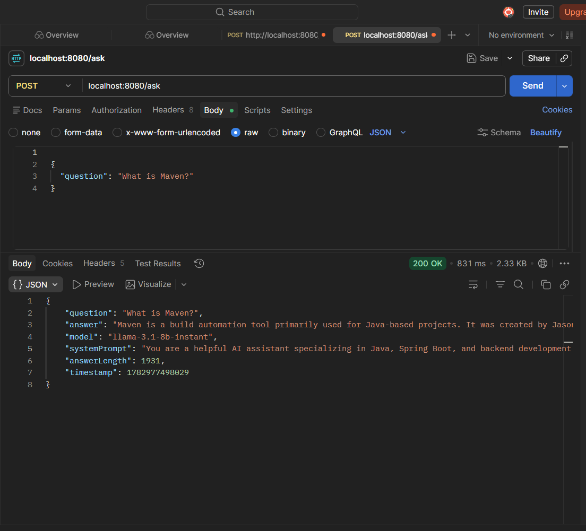
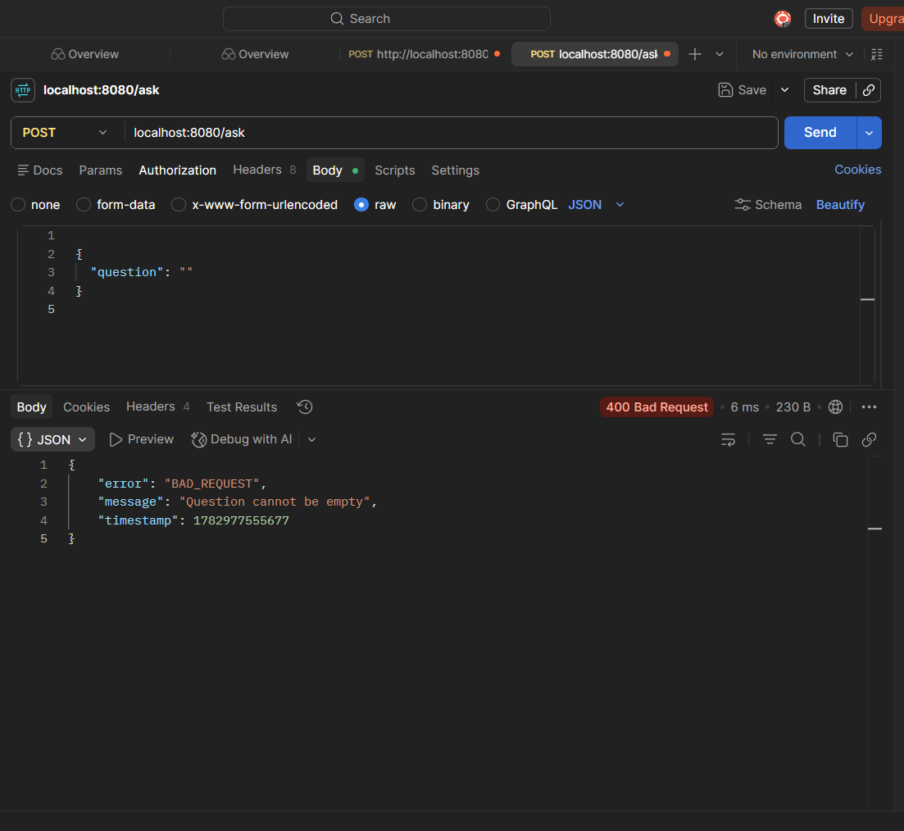

# 🤖 AI Chatbot REST API

A production-ready REST API integrating Spring Boot with Groq's FREE LLaMA 3.1 AI model.

---

## ⚡ Quick Facts

- **Language:** Java 21
- **Framework:** Spring Boot 3.5.16 + Spring AI
- **AI Model:** Groq LLaMA 3.1 (FREE)
- **Architecture:** Modular Monolith
- **Status:** ✅ Production Ready

---

## 🎯 What It Does

Ask questions → AI answers using LLaMA 3.1 → Get JSON response

```json
{
  "question": "What is Spring Boot?",
  "answer": "Spring Boot is...",
  "model": "llama-3.1-8b-instant",
  "timestamp": 1719754800000
}
```

---

## 🚀 30-Second Setup

### 1. Get Groq API Key (FREE)
```
→ console.groq.com
→ Sign up with Google
→ Copy API key
```

### 2. Set Environment Variable
```
GROQ_API_KEY=gsk_your_key
```

### 3. Run App
```bash
mvn spring-boot:run
```

**Done!** App runs on `localhost:8080`

---

## 📡 API Usage

### POST /ask

```bash
curl -X POST http://localhost:8080/ask \
  -H "Content-Type: application/json" \
  -d '{"question": "What is Maven?"}'
```

### Request
```json
{
  "question": "Your question",
  "systemPrompt": "Optional: Your custom prompt"
}
```

### Response (200 OK)
```json
{
  "question": "Your question",
  "answer": "AI generated answer...",
  "model": "llama-3.1-8b-instant",
  "systemPrompt": "Used system prompt",
  "timestamp": 1719754800000,
  "answerLength": 1245
}
```

### Error Response (400/500)
```json
{
  "error": "VALIDATION_ERROR",
  "message": "Question cannot be empty",
  "timestamp": 1719754800000
}
```

---

## 🏗️ Architecture

```
controller/
  └── HelloController.java

dto/
  ├── ChatRequest.java
  └── ChatResponse.java

exception/
  ├── ErrorResponse.java
  └── GlobalExceptionHandler.java
```

**Why this structure?**
- ✅ Clear separation of concerns
- ✅ Easy to test & maintain
- ✅ Professional architecture
- ✅ Scalable design

---

## 🧪 Quick Test

**Test 1: Default Prompt**
```json
POST /ask
{
  "question": "What is Java?"
}
```

**Test 2: Custom Prompt**
```json
POST /ask
{
  "question": "Explain microservices",
  "systemPrompt": "You are an architecture expert"
}
```

**Test 3: Error Handling**
```json
POST /ask
{
  "question": ""
}
→ Returns: "Question cannot be empty"
```

---

## 🔒 Security

✅ API key in environment variable (never in code)
✅ Input validation
✅ Global exception handling
✅ No sensitive data in logs

---

## 📊 Performance

- Response Time: 1-3 seconds
- Model Speed: 560 tokens/sec
- Cost: **FREE**
- Availability: 99.9%

---

## 📚 Tech Stack

| Component | Technology |
|:---|:---|
| Language | Java 21 |
| Framework | Spring Boot 3.5.16 |
| AI Framework | Spring AI 1.0.0-M6 |
| AI Model | Groq LLaMA 3.1 8B |
| Build | Maven |

---

## 🎓 What You'll Learn

- Spring Boot REST API design
- AI/LLM integration in Java
- System prompts & AI behavior control
- Modular monolith architecture
- Error handling best practices
- Security with environment variables

---

## 🔧 Troubleshooting

| Issue | Fix |
|:---|:---|
| Invalid API Key | Restart IDE + verify env var |
| Question empty | Check JSON - must have non-empty question |
| 500 Error | Check console logs + internet connection |
| Connection Refused | Ensure app is running (mvn spring-boot:run) |

---

## 📸 Screenshots





---

## 💼 Resume Point

> "Built production-ready REST API using Spring Boot + Spring AI integrating Groq's LLaMA 3.1. Implemented modular monolith architecture with comprehensive error handling and security best practices."

---

## 🚀 Features

✅ POST REST endpoint
✅ System prompts support
✅ JSON request/response
✅ Error handling
✅ Environment-based config
✅ Production-ready code
✅ Modular architecture

---

## 📄 License

MIT - Free to use

---

## 👤 Author

**CodeWithPreeti8** - Backend Developer | AI Enthusiast

GitHub: [@CodeWithPreeti8](https://github.com/CodeWithPreeti8)
